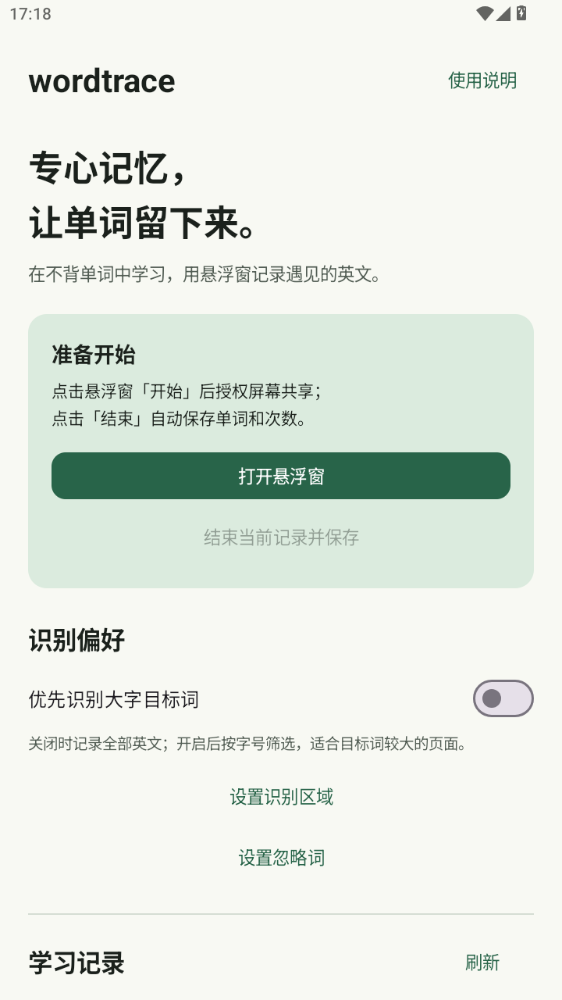
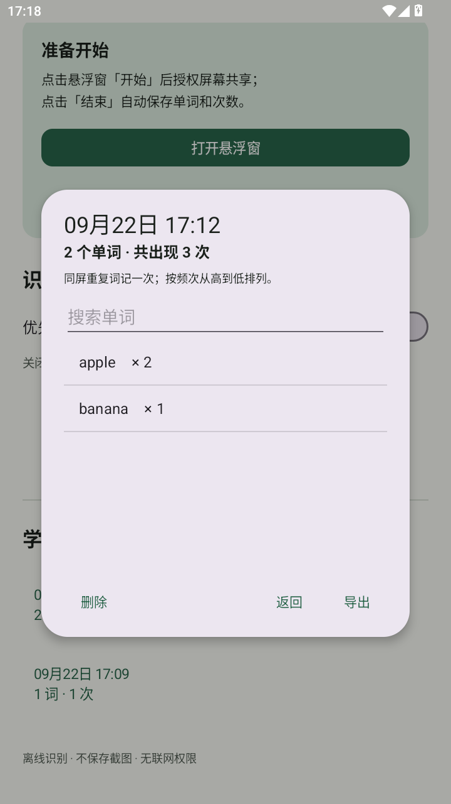

# WordTrace

安卓离线单词记录工具。打开悬浮窗，在不背单词等应用中学习，结束后生成带有出现次数的单词文件。默认中文界面，支持 Android 8.0 及以上的手机和平板。

[下载安装包](https://github.com/HongHui1/wordtrace/releases/latest) · [使用与隐私说明](PRIVACY.md) · [已验证范围](docs/TESTING.md)

截图为早期版本及人工构造的测试词表，当前版本改用小球控制。

<p>
  
  
</p>

## 功能

- 36dp 可拖动悬浮球（48dp 触摸范围）：轻触展开开始、暂停、继续、结束并保存，操作后自动收起。
- Android 11+ 默认通过截图辅助服务识别，不申请 MediaProjection，不接管已有录屏；Android 8–10 或手动选择时保留屏幕共享模式。随 APK 内置 ML Kit 拉丁文字识别模型，首次使用不需下载模型。
- 全部英文 / 大字目标词两种识别方式；可设置屏幕高度范围和忽略词。
- 相同单词持续显示只计一次，短暂识别漏字不立即增加频次；按小写归并。
- 每次学习独立保存，按次数排序，可搜索，导出 CSV / TXT，支持系统分享及文件另存。
- 识别结果发生变化后保存原子检查点，意外退出可恢复；锁屏或系统停止共享后结束并保存。
- 日间 / 深色主题，适配手机和平板宽度，无账号、无广告、无联网权限。

## 安装与使用

下载安装 APK 后，允许安装此来源的应用。首次使用：

1. 打开 WordTrace，点击 **打开悬浮球**，按提示允许「显示在其他应用上层」，返回后再次打开。
2. 切到不背单词，轻触小球，再点 **开始**。Android 11+ 首次会说明截图用途，请同意并在系统无障碍 / 辅助功能中开启 **WordTrace 录屏兼容识别**。
3. 返回不背单词，再点小球 → **开始**。小球可拖动；点开可查看词数、暂停或继续，操作后自动收起。
4. 完成后点小球 → **结束并保存**，自动生成 CSV 和 TXT。在 WordTrace 的 **学习记录** 查看、分享或另存。

**vivo X100s / OriginOS：**保持默认「录屏兼容模式」，按应用提示进入系统辅助功能。不同系统版本的入口名称可能不同，可在设置里搜索「无障碍」。若 Android 13+ 提示「受限设置」，可进入系统的 WordTrace 应用信息页，按系统提示允许受限设置，再开启服务。

辅助服务开启本身不会开始截图，只在你主动开始记录后约每秒取一帧；暂停、返回 WordTrace 或结束时停止取帧，锁屏结束并保存。兼容模式读取整个默认屏幕，请离开学习场景时暂停。

「选择采集方式」保留旧的屏幕共享模式，它**可能结束系统录屏**，启动前会再次提醒。辅助服务未开启或截图失败时不会自动切换到旧模式。

文件最初保存在应用私有目录，**卸载会删除**；需要长期保留时请选择「另存为」，保存到下载目录等位置。CSV 使用 UTF-8 BOM，便于表格软件识别。

### 不背单词建议

默认记录屏幕内全部英文，包括例句。若只想记录当前目标词，可打开「优先识别大字目标词」，再根据你的页面调整识别区域。字号筛选是启发式规则，不能保证识别出的每一项都是词头。本项目不依赖不背单词的私有接口，也不隶属于该应用。

### 次数如何计算

约每秒识别一帧。每帧中同词出现多次仍计一次；同一词一直显示时不增加。在有效识别结果中消失至少约 2 秒后再次出现，增加一次。短于这个间隔的快速切换可能合并，这是为减少 OCR 抖动导致的虚假次数。暂停后恢复同词不重复计数。单复数与时态不合并；保留英文撇号与连字符。

这统计的是**观察到的出现轮次**，不是应用内部的学习次数或一段文章中每个词的排版次数。

## 已知限制

- OCR 可能错认音标、模糊字、复杂背景和小字；极快翻页可能漏记。
- 只处理英文字符，不生成翻译，不声称记录到所有实际出现的词。
- 系统受保护页面（FLAG_SECURE）无法识别；兼容截图连续失败会结束并保存。
- 兼容截图和全屏共享会包含其他应用可见内容；请只在学习时使用。返回 WordTrace 时跳过识别。
- 部分系统需手动允许后台运行；系统强制结束时保留最近一次成功检查点，尚未完成的识别可能丢失。
- 旧屏幕共享模式每次记录需要系统授权。兼容模式依赖截图辅助服务和厂商系统支持；未在 vivo X100s 上实测。
- 模拟器检查不能替代你手机和平板上、特定不背单词版本的真机验证。

## 本地构建

需要 JDK 17 或 21，Android SDK Platform 35 / Build Tools 35.0.0。Android Studio 可直接打开仓库。

```sh
./gradlew testDebugUnitTest lintDebug assembleDebug
```

Windows 使用 `gradlew.bat`。配置 `ANDROID_HOME` 或本地 `local.properties` 的 `sdk.dir`。调试包输出到 `app/build/outputs/apk/debug/app-debug.apk`，可直接安装用于测试。

### 正式签名

签名文件与密码不应提交到 Git。构建通过环境变量读取：

```text
WORDTRACE_KEYSTORE=/absolute/path/to/wordtrace-release.jks
WORDTRACE_STORE_PASSWORD=...
WORDTRACE_KEY_ALIAS=wordtrace
WORDTRACE_KEY_PASSWORD=...
```

```sh
./gradlew assembleRelease
```

未配置签名时，release 产物为未签名 APK。请妥善备份自己的密钥：后续覆盖安装需要同一签名。调试版与正式版的签名不同，切换前先导出记录，再卸载旧版本。

Windows 可运行 `powershell -ExecutionPolicy Bypass -File scripts/build-release.ps1`，自动在 `%LOCALAPPDATA%/WordTrace/signing` 创建一次本机发布密钥与凭据，再构建到 `dist/wordtrace-1.1.0.apk`。**请私下备份该 signing 文件夹，勿上传至 GitHub**；凭据文件包含密钥密码。

## GitHub 开源

仓库包含 MIT 许可证、隐私说明、贡献指南、问题模板、GitHub Actions 自动构建。推送源码后，Actions 的 `debug-apk` artifact 提供测试安装包。正式分发应使用自己的发布密钥，配置后上传到 Releases。

```sh
git init -b main
git add .
git commit -m "Initial WordTrace Android app"
gh repo create wordtrace --public --source=. --remote=origin --push
```

请先检查暂存区，避免提交个人学习记录、签名密钥或本地构建工具。`.gitignore` 已排除工具、构建输出及常用密钥扩展名。

## 技术结构

`MainActivity` 管理配置、历史与导出；`OverlayService` 管理可拖动悬浮球；`CaptureConsentActivity` 按模式进行告知与授权；`ScreenReaderService` 仅提供主动请求的截图；`CaptureService` 前台获取画面并执行 OCR；`WordCounter` 负责纯 Java 计数；`SessionStore` 原子保存记录并生成导出文件。

项目代码采用 [MIT](LICENSE)。Google ML Kit 及其模型、AndroidX、Material 等依赖遵循各自的许可证 / 服务条款，见 [THIRD_PARTY_NOTICES.md](THIRD_PARTY_NOTICES.md)。
